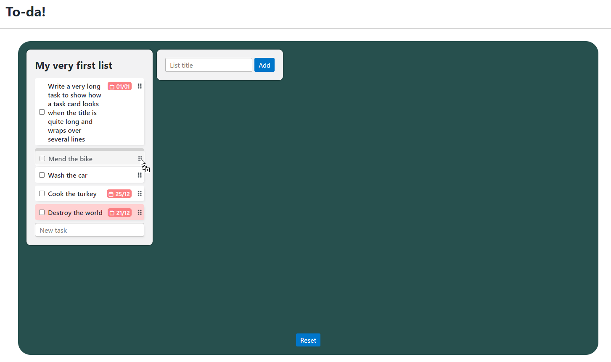

[Live demo](https://harristom.github.io/odin-todo)

_[To-da!](https://harristom.github.io/odin-todo)_ is a to-do list app written in vanilla JavaScript for [the Odin Project's Todo List exercise](https://www.theodinproject.com/lessons/node-path-javascript-todo-list).

## Project requirements
In addition to the fundamental user requirements (for adding tasks, deleting them, etc.) the principle requirements of the assignment are: 
1. To use OOP principles for the tasks and lists
2. To separate code into modules using native ES6 JS modules and/or a bundler
3. To use local storage to persist the user's data

## Approach
Although not a strict requirement of the exercise, I decided I wanted to lean into the web platform's native capabilities using vanilla JavaScript and not use frameworks or libraries as far as possible.

In addition to following the base requirements, I also explored the native HTML Drag and Drop API to allow users to re-order their tasks within a list and move them between lists.

As drag and drop is not well supported on mobile, I did end up using a [polyfill](https://github.com/Bernardo-Castilho/dragdroptouch) for this functionality on touch devices.

## Future improvements
If I were to continue developing this project beyond the scope of what was required for the exercise I would look into the following:

1. Use Web Components to better encapsulate the DOM manipulation logic for task and list UI elements
2. Use event listeners to ensure that changes made to lists/tasks in another browser tab are reflected across tabs
3. Although I enjoyed learning about the native drag and drop API, it has many limitations, principally around styling and mobile compatibility. I would not use this next time and would implement the functionality more directly (using mouse events).
4. Allow adding multiple "boards" of lists
5. Add a backend so users can save their board and access on another browser
6. Allow users to collaborate on boards
7. Add sorting to lists (e.g. by date or alphabetically)